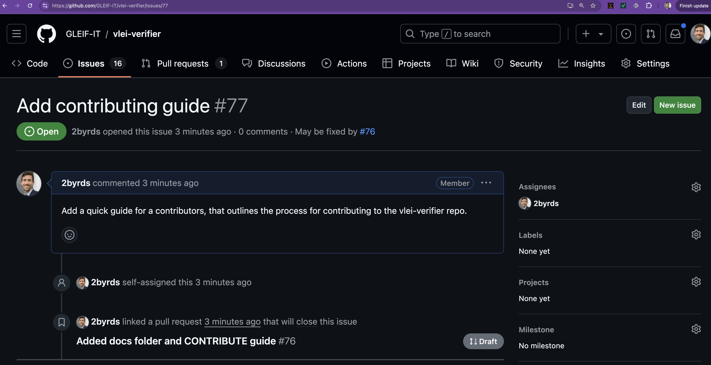
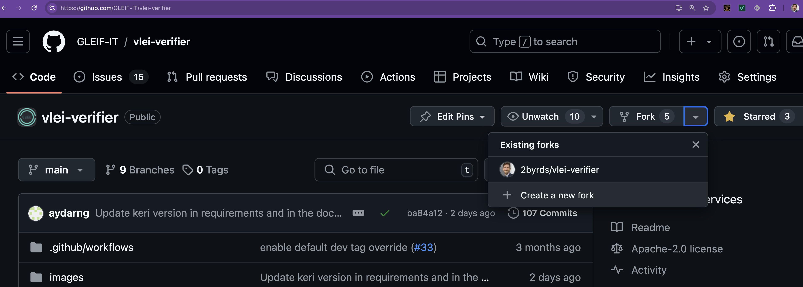
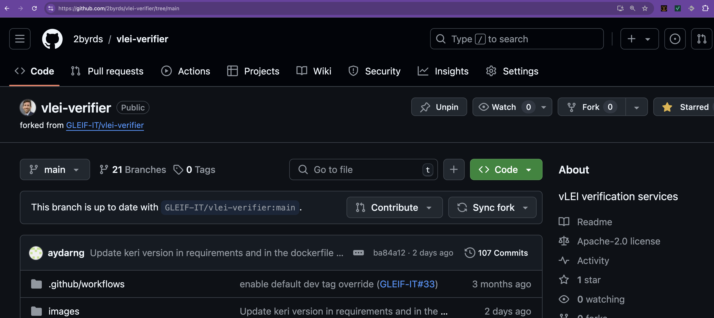
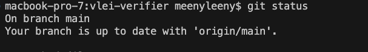
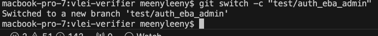
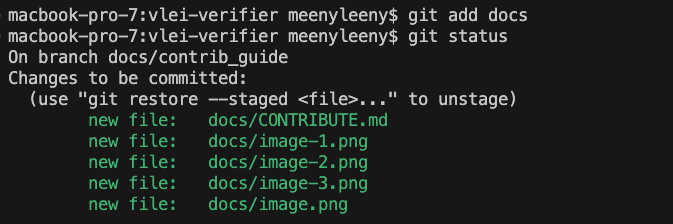
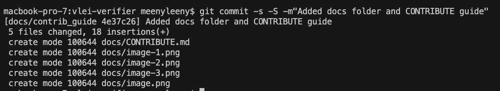
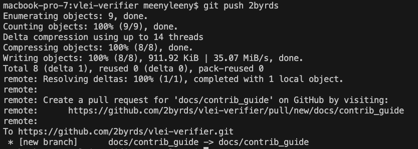
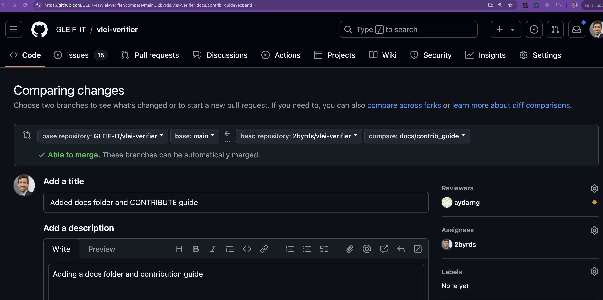
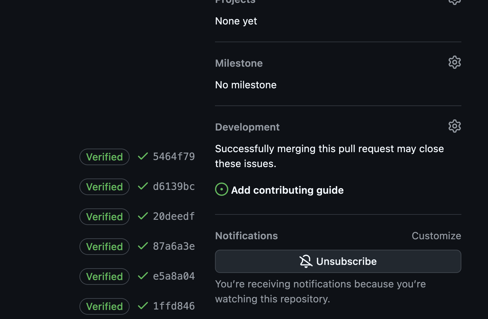

# This is a rough guide for contributing to this repository

* Create an issue with details of the change you want to make


# Fork the repo into your own GitHub account
* In your browser go to https://github.com/GLEIF-IT/vlei-verifier
* Click the "Fork" button in the top right corner of the page
* Fork the repo into your own GitHub account



# Start from main
* From your terminal or IDE, clone your forked repo
```
git clone https://github.com/2byrds/vlei-verifier.git
```
* Confirm you are starting from the main branch
```
git status
```


# Create new branch
* Switch from main, creating a new branch [semantically named](https://gist.github.com/seunggabi/87f8c722d35cd07deb3f649d45a31082#file-semantic-branch-names-md) to something like 'docs/contrib_guide'

```
git switch -c "docs/contrib_guide"
```


# Add/Commit the changes to the branch
* Git add your changes and commit them. Note that the -s flag signs the commit and the -S flag signs the commit with a GPG key. That is currently optional but preferred.
```
git add docs
```


```
git commit -s -S -m"Added docs folder and CONTRIBUTE guide"
```


# Push the changes to your fork
```git push 2byrds```


# Create a pull request
* Go to your forked repo in your browser
* Click the "New pull request" button
* Set the reviewer to 2byrds (or whoever you want to review your changes)
* Add a title and description
* Set yourself as the assignee
* Under development, associate your PR with the issue you are working on
* Click "Create draft pull request" until it is ready for final review
* Click "Ready for review" when you are ready for the reviewer to look at the changes to be merged




# Go through review
* Respond to the reviewers questions/comments/requests
* Note there are several automated checks listed on the PR overview that must all pass

# Merge and Issue update
* Once approved the pull request will be merged and the issue can be updated/close