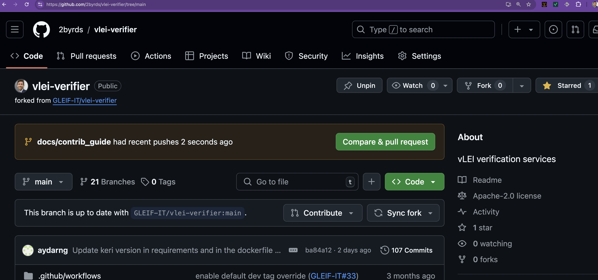

# This is a rough guide for contributing to this repository

# Fork the repo into your own GitHub account
* In your browser go to https://github.com/GLEIF-IT/vlei-verifier
* Click the "Fork" button in the top right corner of the page
* Fork the repo into your own GitHub account


# Start from main
* From your terminal or IDE, clone your forked repo
```
git clone https://github.com/2byrds/vlei-verifier.git
```
* Confirm you are starting from the main branch
```
git status
```


# Create new branch
* Switch from main, creating a new branch [semantically named](https://gist.github.com/seunggabi/87f8c722d35cd07deb3f649d45a31082#file-semantic-branch-names-md) to something like 'docs/contrib_guide'

```
git switch -c "test/auth_eba_admin"
```


# Add/Commit the changes to the branch
* Git add your changes and commit them. Note that the -s flag signs the commit and the -S flag signs the commit with a GPG key. That is currently optional but preffered.
```
git add docs
```


```
git commit -s -S -m"Added docs folder and CONTRIBUTE guide"
```


# Push the changes to your fork
```git push 2byrds```


# Create a pull request
* Go to your forked repo in your browser
* Click the "New pull request" button
* Set the reviewer to 2byrds (or whoever you want to review your changes)
* Add a title and description
* Set yourself as the assignee
